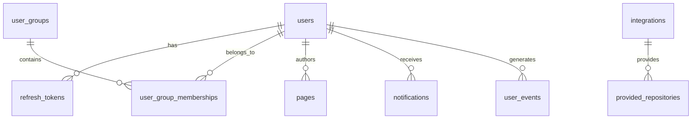

# Tabby 数据库设计文档

本文档详细描述了 Tabby 项目的数据库结构设计。

## 目录
1. [用户认证相关表](#1-用户认证相关表)
2. [第三方认证相关表](#2-第三方认证相关表)
3. [代码仓库相关表](#3-代码仓库相关表)
4. [文档和内容相关表](#4-文档和内容相关表)
5. [权限控制相关表](#5-权限控制相关表)
6. [系统配置相关表](#6-系统配置相关表)
7. [其他功能表](#7-其他功能表)

## 1. 用户认证相关表

### users（用户表）
存储用户的基本信息，包括认证信息和用户属性。

| 字段名 | 类型 | 说明 | 约束 |
|--------|------|------|------|
| id | INTEGER | 主键 | PRIMARY KEY AUTOINCREMENT |
| email | VARCHAR(150) | 用户邮箱 | NOT NULL, UNIQUE |
| is_admin | BOOLEAN | 是否管理员 | NOT NULL DEFAULT 0 |
| auth_token | VARCHAR(128) | 认证令牌 | NOT NULL, UNIQUE |
| password_encrypted | VARCHAR(128) | 加密密码 | |
| avatar | BLOB | 头像 | |
| name | VARCHAR(255) | 用户名 | |
| active | BOOLEAN | 是否激活 | NOT NULL DEFAULT 1 |
| created_at | TIMESTAMP | 创建时间 | DEFAULT now |
| updated_at | TIMESTAMP | 更新时间 | DEFAULT now |

### refresh_tokens（刷新令牌表）
管理用户的登录会话信息。

| 字段名 | 类型 | 说明 | 约束 |
|--------|------|------|------|
| id | INTEGER | 主键 | PRIMARY KEY AUTOINCREMENT |
| user_id | INTEGER | 用户ID | NOT NULL, FOREIGN KEY |
| token | VARCHAR(255) | 刷新令牌 | NOT NULL, UNIQUE |
| expires_at | TIMESTAMP | 过期时间 | NOT NULL |
| created_at | TIMESTAMP | 创建时间 | DEFAULT now |

## 2. 第三方认证相关表

### oauth_credential（OAuth认证表）
存储OAuth认证的配置信息。

| 字段名 | 类型 | 说明 | 约束 |
|--------|------|------|------|
| id | INTEGER | 主键 | PRIMARY KEY AUTOINCREMENT |
| provider | TEXT | 提供商 | NOT NULL, UNIQUE |
| client_id | VARCHAR(256) | 客户端ID | NOT NULL |
| client_secret | VARCHAR(64) | 客户端密钥 | NOT NULL |
| created_at | TIMESTAMP | 创建时间 | NOT NULL DEFAULT now |
| updated_at | TIMESTAMP | 更新时间 | NOT NULL DEFAULT now |

### ldap_credential（LDAP认证表）
存储LDAP服务器的配置信息。

| 字段名 | 类型 | 说明 | 约束 |
|--------|------|------|------|
| id | INTEGER | 主键 | PRIMARY KEY AUTOINCREMENT |
| host | STRING | 主机地址 | NOT NULL |
| port | INTEGER | 端口 | NOT NULL DEFAULT 389 |
| bind_dn | STRING | 绑定DN | NOT NULL |
| bind_password | STRING | 绑定密码 | NOT NULL |
| base_dn | STRING | 基础DN | NOT NULL |
| user_filter | STRING | 用户过滤器 | NOT NULL |
| encryption | STRING | 加密方式 | NOT NULL DEFAULT 'none' |
| email_attribute | STRING | 邮箱属性 | NOT NULL DEFAULT 'email' |
| name_attribute | STRING | 名称属性 | |

## 3. 代码仓库相关表

### repositories（仓库表）
存储代码仓库的基本信息。

| 字段名 | 类型 | 说明 | 约束 |
|--------|------|------|------|
| id | INTEGER | 主键 | PRIMARY KEY AUTOINCREMENT |
| name | VARCHAR(255) | 仓库名称 | NOT NULL, UNIQUE |
| git_url | VARCHAR(255) | Git URL | NOT NULL, UNIQUE |

### integrations（集成表）
存储第三方服务集成的配置信息。

| 字段名 | 类型 | 说明 | 约束 |
|--------|------|------|------|
| id | INTEGER | 主键 | PRIMARY KEY AUTOINCREMENT |
| kind | TEXT | 集成类型 | NOT NULL |
| display_name | TEXT | 显示名称 | NOT NULL |
| access_token | TEXT | 访问令牌 | NOT NULL |
| api_base | TEXT | API基础URL | |
| error | TEXT | 错误信息 | |
| synced | BOOLEAN | 是否同步 | NOT NULL DEFAULT FALSE |
| created_at | TIMESTAMP | 创建时间 | NOT NULL DEFAULT now |
| updated_at | TIMESTAMP | 更新时间 | NOT NULL DEFAULT now |

## 4. 文档和内容相关表

### web_documents（网页文档表）
存储网页文档的信息。

| 字段名 | 类型 | 说明 | 约束 |
|--------|------|------|------|
| id | INTEGER | 主键 | PRIMARY KEY AUTOINCREMENT |
| name | VARCHAR(255) | 文档名称 | NOT NULL, UNIQUE |
| url | TEXT | 文档URL | NOT NULL, UNIQUE |
| is_preset | BOOLEAN | 是否预设 | NOT NULL DEFAULT FALSE |
| created_at | TIMESTAMP | 创建时间 | NOT NULL DEFAULT now |
| updated_at | TIMESTAMP | 更新时间 | NOT NULL DEFAULT now |

### pages（页面表）
存储页面内容信息。

| 字段名 | 类型 | 说明 | 约束 |
|--------|------|------|------|
| id | INTEGER | 主键 | PRIMARY KEY AUTOINCREMENT |
| author_id | INTEGER | 作者ID | NOT NULL, FOREIGN KEY |
| title | TEXT | 标题 | |
| content | TEXT | 内容 | |
| code_source_id | VARCHAR(255) | 代码源ID | |
| created_at | TIMESTAMP | 创建时间 | NOT NULL DEFAULT now |
| updated_at | TIMESTAMP | 更新时间 | NOT NULL DEFAULT now |

## 5. 权限控制相关表

### user_groups（用户组表）
存储用户组信息。

| 字段名 | 类型 | 说明 | 约束 |
|--------|------|------|------|
| id | INTEGER | 主键 | PRIMARY KEY AUTOINCREMENT |
| name | VARCHAR(255) | 组名称 | NOT NULL, UNIQUE |
| created_at | TIMESTAMP | 创建时间 | NOT NULL DEFAULT now |
| updated_at | TIMESTAMP | 更新时间 | NOT NULL DEFAULT now |

### user_group_memberships（用户组成员关系表）
管理用户与用户组的关系。

| 字段名 | 类型 | 说明 | 约束 |
|--------|------|------|------|
| id | INTEGER | 主键 | PRIMARY KEY AUTOINCREMENT |
| user_id | INTEGER | 用户ID | NOT NULL, FOREIGN KEY |
| user_group_id | INTEGER | 用户组ID | NOT NULL, FOREIGN KEY |
| is_group_admin | BOOLEAN | 是否组管理员 | NOT NULL DEFAULT FALSE |
| created_at | TIMESTAMP | 创建时间 | NOT NULL DEFAULT now |
| updated_at | TIMESTAMP | 更新时间 | NOT NULL DEFAULT now |

## 6. 系统配置相关表

### server_setting（服务器设置表）
存储服务器配置信息。

| 字段名 | 类型 | 说明 | 约束 |
|--------|------|------|------|
| id | INTEGER | 主键 | PRIMARY KEY AUTOINCREMENT |
| security_allowed_register_domain_list | STRING | 允许注册的域名列表 | |
| security_disable_client_side_telemetry | BOOLEAN | 是否禁用客户端遥测 | NOT NULL DEFAULT FALSE |
| network_external_url | STRING | 外部URL | NOT NULL DEFAULT 'http://localhost:8080' |
| billing_enterprise_license | STRING | 企业许可证 | |
| security_disable_password_login | BOOLEAN | 是否禁用密码登录 | NOT NULL DEFAULT FALSE |

### email_setting（邮件设置表）
存储邮件服务器配置信息。

| 字段名 | 类型 | 说明 | 约束 |
|--------|------|------|------|
| id | INTEGER | 主键 | PRIMARY KEY AUTOINCREMENT |
| smtp_username | VARCHAR(255) | SMTP用户名 | NOT NULL |
| smtp_password | VARCHAR(255) | SMTP密码 | NOT NULL |
| smtp_server | VARCHAR(255) | SMTP服务器 | NOT NULL |
| from_address | VARCHAR(255) | 发件人地址 | NOT NULL |
| encryption | VARCHAR(255) | 加密方式 | NOT NULL DEFAULT 'ssltls' |
| auth_method | VARCHAR(255) | 认证方式 | NOT NULL DEFAULT 'plain' |
| smtp_port | INTEGER | SMTP端口 | NOT NULL DEFAULT 25 |

## 7. 其他功能表

### notifications（通知表）
存储系统通知信息。

| 字段名 | 类型 | 说明 | 约束 |
|--------|------|------|------|
| id | INTEGER | 主键 | PRIMARY KEY AUTOINCREMENT |
| recipient | VARCHAR(255) | 接收者 | NOT NULL DEFAULT 'admin' |
| content | TEXT | 通知内容 | NOT NULL |
| created_at | TIMESTAMP | 创建时间 | NOT NULL DEFAULT now |
| updated_at | TIMESTAMP | 更新时间 | NOT NULL DEFAULT now |

### job_runs（任务运行表）
记录后台任务的执行情况。

| 字段名 | 类型 | 说明 | 约束 |
|--------|------|------|------|
| id | INTEGER | 主键 | PRIMARY KEY AUTOINCREMENT |
| job | VARCHAR(255) | 任务名称 | NOT NULL |
| start_ts | TIMESTAMP | 开始时间 | NOT NULL |
| end_ts | TIMESTAMP | 结束时间 | |
| exit_code | INTEGER | 退出码 | |
| stdout | TEXT | 标准输出 | NOT NULL |
| stderr | TEXT | 标准错误 | NOT NULL |
| command | TEXT | 命令 | |
| started_at | TIMESTAMP | 启动时间 | |
| created_at | TIMESTAMP | 创建时间 | DEFAULT now |
| updated_at | TIMESTAMP | 更新时间 | DEFAULT now |

## 数据库关系图

## 注意事项

1. 所有表都包含 `created_at` 和 `updated_at` 时间戳字段，用于记录数据的创建和更新时间。
2. 外键关系都设置了 `ON DELETE CASCADE`，确保数据的一致性。
3. 敏感信息（如密码）都采用加密存储。
4. 所有唯一性约束都通过索引实现，提高查询效率。